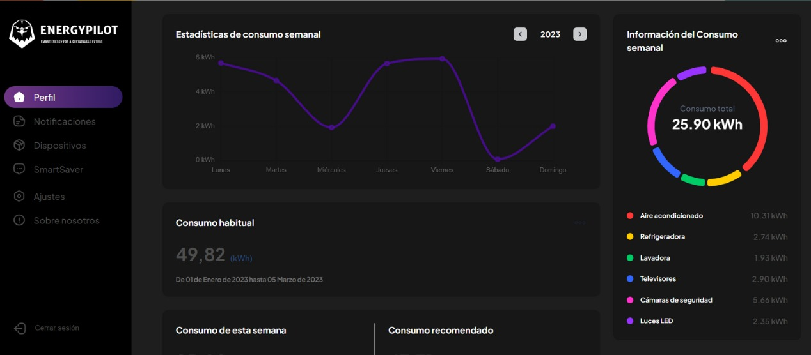

# EnergyPilot
<h2>Description</h2>

Energy Pilot is a web platform that allows users to monitor and improve the consumption of electrical energy both in the home and workplace. This solution is based on artificial intelligence and uses smart plugs to turn all electrical devices into smart and remotely controllable devices.

This repo contains the idea of UI (User Interface) of the platform

<h2>Technologies</h2>

To build this app, they were used:

<ul>
    <li>ReactJS + Vite</li>    
    <li>HTML/CSS/JS</li>    
    <li>TailwindCSS</li>    
    <li>ChartJS</li>
</ul>

